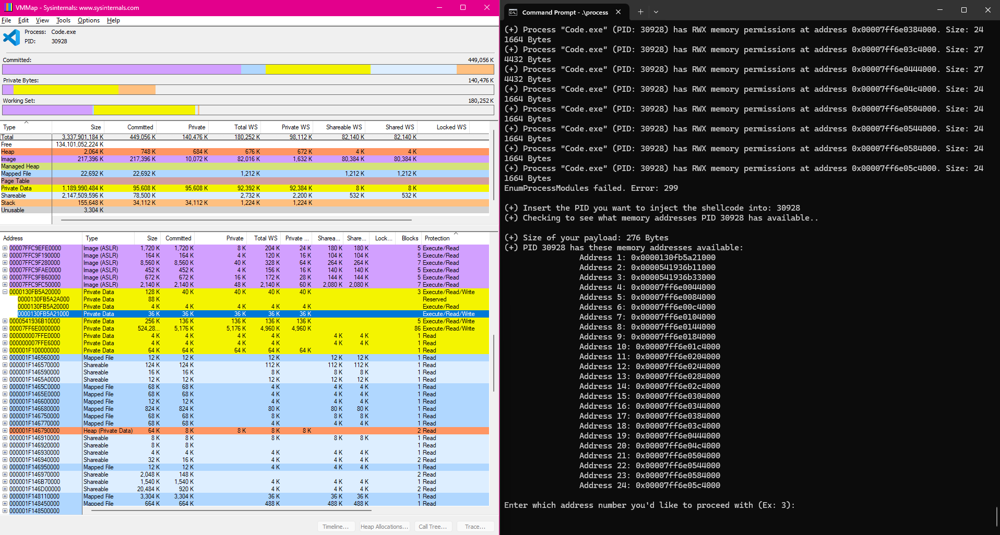
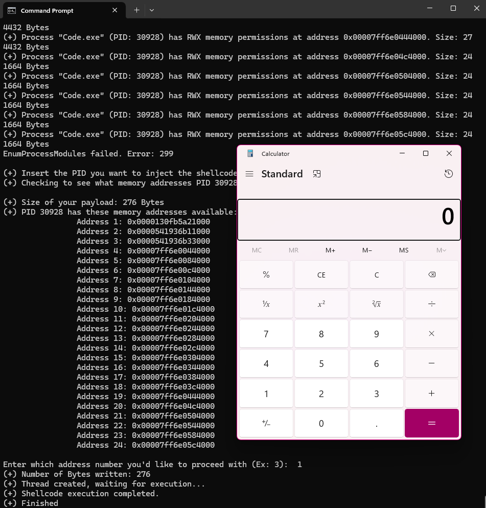

# Process-Memory-RWX-Injector

# Introduction
Remote process injection on a target that already has allotted RWX memory regions

# Usage
Clone the repository to your local machine.\
Compile the code using a C compiler.\
Run the executable.
## Example Compilation & Execution
```sh
# Clone the repository
git clone https://github.com/TechTreker/Process-Memory-RWX-Injector.git

# Navigate to project directory
cd Process-Memory-RWX-Injector

# Adjust the shellcode as necessary.
It is currently set to run calc.exe

# Compile the code
gcc processRWXInjector.c -o processRWXInjector.exe


# Run the executable
.\processRWXInjector.exe
```
# Notes
This program works by gathering all PIDs on a Windows system (Ones that we can obtain a handle to) and examining their memory contents to see which ones have Read, Write, and Execute permissions. Once you select a PID that has RWX memory locations, you can inject your shellcode into that memory region.\

Program in use. Using Windows Sysinternals to confirm memory locations have RWX permissions. `Address 1` is highlighted in blue on vmmap. 


Injected the shellcode into `code.exe`, or PID 30928 in this demo.

